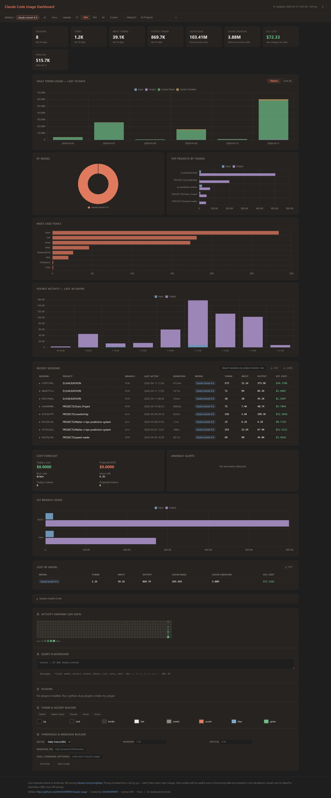

# Claude Code Usage Dashboard

[](LICENSE)
[](https://claude.ai/code)

**Pro and Max subscribers get a progress bar. This gives you the full picture.**

Claude Code writes detailed usage logs locally — token counts, models, sessions, projects — regardless of your plan. This dashboard reads those logs and turns them into charts and cost estimates. Works on API, Pro, and Max plans.




---

## What this tracks

Works on **API, Pro, and Max plans** — Claude Code writes local usage logs regardless of subscription type. This tool reads those logs and gives you visibility that Anthropic's UI doesn't provide.

Captures usage from:
- **Claude Code CLI** (`claude` command in terminal)
- **VS Code extension** (Claude Code sidebar)
- **Dispatched Code sessions** (sessions routed through Claude Code)

**Not captured:**
- **Cowork sessions** — these run server-side and do not write local JSONL transcripts

---

## Requirements

- Python 3.8+
- No third-party packages — uses only the standard library (`sqlite3`, `http.server`, `json`, `pathlib`)

> Anyone running Claude Code already has Python installed.

## Quick Start (Run from source in any IDE/terminal)

No `pip install`, no virtual environment, no build step required.

### Windows
```bash
git clone https://github.com/DEADSERPENT/claude-usage
cd claude-usage
python cli.py scan
python cli.py dashboard
```

### macOS / Linux
```bash
git clone https://github.com/DEADSERPENT/claude-usage
cd claude-usage
python3 cli.py scan
python3 cli.py dashboard
```

---

## Usage

> On macOS/Linux, use `python3` instead of `python` in all commands below.

### Core commands (run from source)

```bash
# Scan JSONL files and populate the database (~/.claude/usage.db)
python cli.py scan

# Show today's usage summary by model (in terminal)
python cli.py today

# Show all-time statistics (in terminal)
python cli.py stats

# Scan + open browser dashboard at http://localhost:8080
python cli.py dashboard

# Query sessions with DSL filters
python cli.py query "tokens > 1M AND model~sonnet"

# Detect anomalies and get optimization recommendations
python cli.py anomalies
python cli.py optimize

# Launch REST API server on localhost
python cli.py api
```

The scanner is incremental — it tracks each file's path and modification time, so re-running `scan` is fast and only processes new or changed files.

---

## How it works

Claude Code writes one JSONL file per session to `~/.claude/projects/`. Each line is a JSON record; `assistant`-type records contain:
- `message.usage.input_tokens` — raw prompt tokens
- `message.usage.output_tokens` — generated tokens
- `message.usage.cache_creation_input_tokens` — tokens written to prompt cache
- `message.usage.cache_read_input_tokens` — tokens served from prompt cache
- `message.model` — the model used (e.g. `claude-sonnet-4-6`)

`scanner.py` parses those files and stores the data in a SQLite database at `~/.claude/usage.db`.

`dashboard.py` serves a single-page dashboard on `localhost:8080` with Chart.js charts (loaded from CDN). It auto-refreshes every 30 seconds and supports model filtering with bookmarkable URLs.

---

## Cost estimates

Costs are calculated using **Anthropic API pricing as of April 2026** ([claude.com/pricing#api](https://claude.com/pricing#api)).

**Only models whose name contains `opus`, `sonnet`, or `haiku` are included in cost calculations.** Local models, unknown models, and any other model names are excluded (shown as `n/a`).

| Model | Input | Output | Cache Write | Cache Read |
|-------|-------|--------|------------|-----------|
| claude-opus-4-6 | $6.15/MTok | $30.75/MTok | $7.69/MTok | $0.61/MTok |
| claude-sonnet-4-6 | $3.69/MTok | $18.45/MTok | $4.61/MTok | $0.37/MTok |
| claude-haiku-4-5 | $1.23/MTok | $6.15/MTok | $1.54/MTok | $0.12/MTok |

> **Note:** These are API prices. If you use Claude Code via a Max or Pro subscription, your actual cost structure is different (subscription-based, not per-token).

---

## Budget Guardian (automatic cost protection)

Set a daily spending limit and the system automatically monitors every scan, warns at thresholds, and can kill Claude processes if the limit is exceeded.

### Quick setup

```bash
# Set a $10/day limit with automatic enforcement
export CLAUDE_USAGE_CIRCUIT_BREAKER=1
export CLAUDE_USAGE_DAILY_LIMIT_USD=10.00

# Start the background daemon — it scans, checks budget, and alerts automatically
python cli.py daemon start
```

### How it works

After every scan (manual, dashboard, or daemon), the system:

1. **Checks budget thresholds** at 50%, 80%, and 100% of the daily limit
2. **Fires notifications** via shell commands and/or webhooks (configured in `~/.claude/usage_hooks.json`)
3. **Triggers the circuit breaker** when 100% is reached, taking the configured action
4. **Notifies plugins** via the `on_alert` hook for custom integrations

### Environment variables

| Variable | Default | Description |
|----------|---------|-------------|
| `CLAUDE_USAGE_CIRCUIT_BREAKER` | `0` | Set to `1` to enable automatic checking |
| `CLAUDE_USAGE_DAILY_LIMIT_USD` | `0` | Daily spending cap in USD (0 = disabled) |
| `CLAUDE_USAGE_CIRCUIT_BREAKER_ACTION` | `warn` | Action when tripped: `warn`, `kill`, or `block` |

### Actions

| Action | Behavior |
|--------|----------|
| `warn` | Logs a warning (default, safe) |
| `kill` | Terminates running Claude Code processes |
| `block` | Renames the Claude binary to prevent launching |

### Notification hooks

Add budget-specific hooks to `~/.claude/usage_hooks.json`:

```json
{
  "daily_cost_usd": {
    "warn": 5.00,
    "critical": 10.00,
    "on_warn": "notify-send 'Claude Budget' '50%+ of daily limit used'",
    "on_critical": "notify-send 'Claude Budget' 'Daily limit reached!'",
    "webhook_url": "http://localhost:5000/budget-alert"
  }
}
```

---

## Files

| File | Purpose |
|------|---------|
| `scanner.py` | Parses JSONL transcripts, writes to `~/.claude/usage.db` |
| `dashboard.py` | HTTP server + single-page HTML/JS dashboard |
| `cli.py` | Main command entrypoint (`scan`, `today`, `stats`, `dashboard`, etc.) |
| `api_server.py` | Local REST API for sessions, costs, models, tools, and health |
| `query_engine.py` | DSL parser/executor for local analytics queries |
| `anomaly.py` | Usage spike/anomaly detection |
| `optimizer.py` | Cost optimization recommendations |
| `archiver.py` | Archive and time-travel helpers for usage history |
| `circuit_breaker.py` | Automatic budget enforcement and cost protection |
| `invoice.py` | HTML usage reports (print/PDF/CSV) |
| `sync.py` | Cross-machine JSON export/import |
| `tui.py` | Interactive terminal UI (htop-style) |
| `daemon.py` | Background scanner daemon with file watching |
| `hooks.py` | Threshold-based shell/webhook notifications |
| `plugins.py` | Plugin system for extending functionality |
